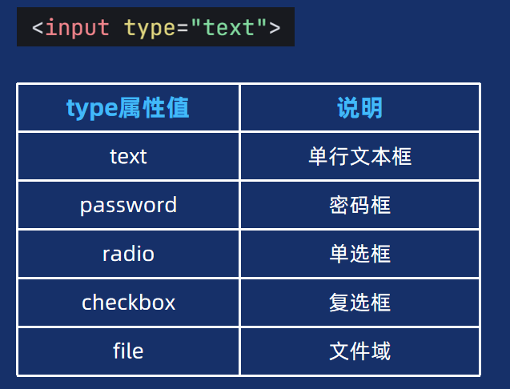
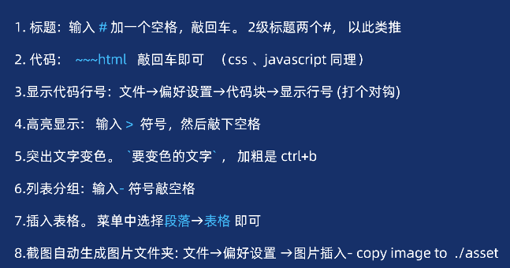

# 表单

表单：是用于收集用户输入数据，并将数据提交到后端进行处理。

场景：

- 用户登录\注册
- 搜索框
- 联系表单
- 问卷调查
- 订单支付
- 文件上传...

## 表单容器

作用：定义表单的容器，包裹所有`表单控件`。

~~~html
<form action=""></form>
~~~

action 属性定义了在`提交表单`时，应该把所**收集**的**数据**送给谁（URL）去处理。

>注意： form 千万不要写成 from啦~

## 表单控件

### input表单控件

### select表单

### textarea文本域

### button 表单

| type属性值 | 说明       |
| ---------- | ---------- |
| text       | 单行文本框 |
| password   | 密码框     |
| radio      | 单选框     |
| checkbox   | 复选框     |
| file       | 文件域     |

| 123  | 123  |      |
| ---- | ---- | ---- |
| 123  | 123  |      |
| 123  | 123  |      |
|      |      |      |
|      |      |      |
|      |      |      |
|      |      |      |

~~~css
html {
    font-size: 12px;
}
~~~

~~~javascript
let num = 10 
~~~

~~~html
  <form action="">
    <!-- 1. 单行文本框和密码框 -->
    <ul>
      <li>
        <label>
          账号： <input type="text" placeholder="请输入账号" name="username" accesskey="s" autocomplete="off">
        </label>
      </li>
      <li>
        密码： <input type="password" placeholder="请输入密码" name="pwd" maxlength="6">
      </li>
      <!-- 2. 单选框 复选框和文件域 -->
      <li>
        性别：
        <!-- label 方式一   for  id 关联 -->
        <input type="radio" name="gender" value="0" checked id="nv">
        <label for="nv">女</label>
        <input type="radio" name="gender" value="1" id="nan">
        <label for="nan">男</label>
      </li>
      <li>
        爱好：
        <!-- label 方式二 -->
        <label>
          <input type="checkbox" name="hobby" value="0" checked> 足球
        </label>
        <label>
          <input type="checkbox" name="hobby" value="1"> 篮球
        </label>
        <label>
          <input type="checkbox" name="hobby" value="2"> 双色球
        </label>

      </li>
      <li>
        头像：
        <input type="file" name="file" multiple accept=".exe,.jpg">
      </li>
      <!-- 文本域 下拉列表和button按钮 -->
      <li>
        <label>
          留言：
          <textarea name="msg" cols="30" rows="10" placeholder="请输入留言"></textarea>
        </label>
      </li>
      <li>
        城市：
        <select name="city" id="">
          <option value="北京">北京</option>
          <option value="上海" selected>上海</option>
          <option value="广州">广州</option>
        </select>
      </li>
      <li>
        <button disabled>注册</button>
      </li>
    </ul>

  </form>
~~~

 

## 辅助标签

